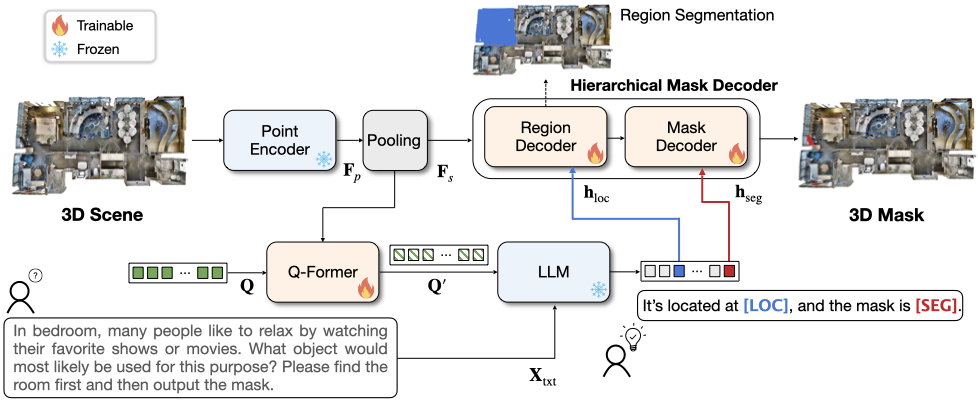
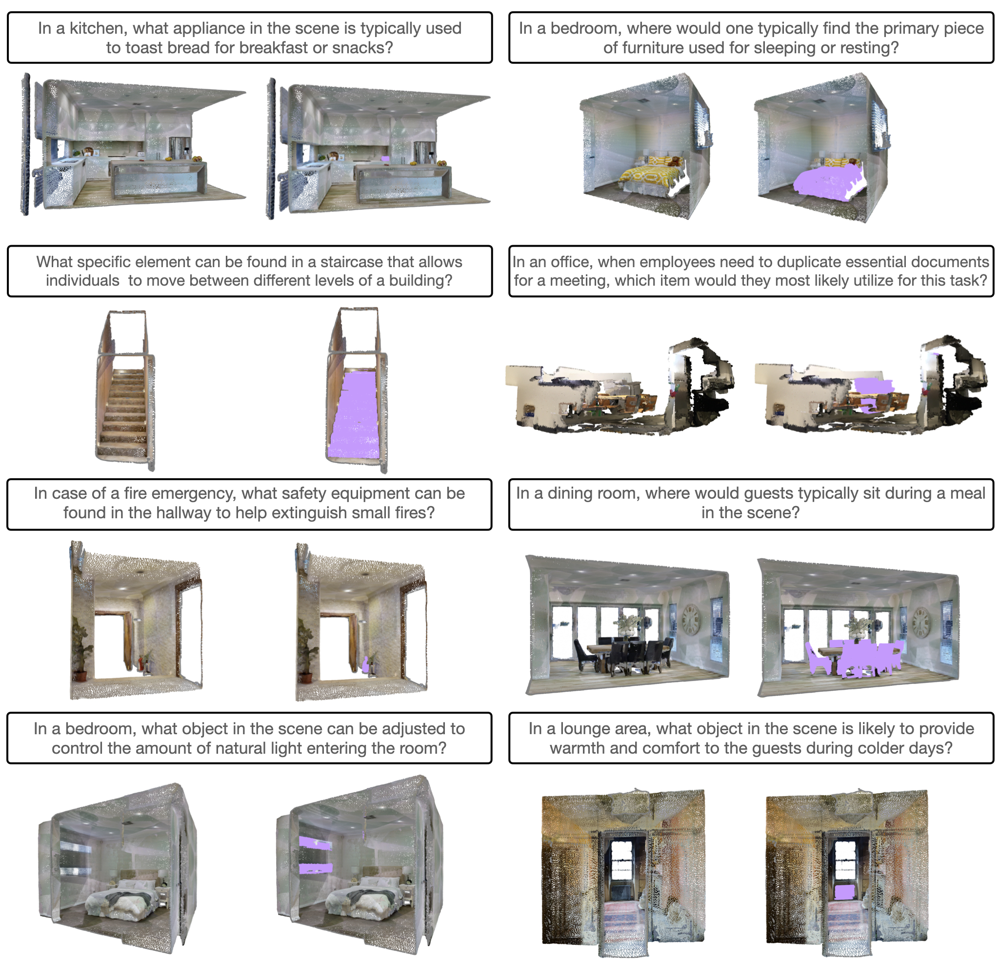

<p align="center">
  <h1 align="center">Reason3D: Searching and Reasoning 3D Segmentation via Large Language Model [3DV 2025]
  </h1>
  <p align="center">
    <a href="https://kuanchihhuang.github.io/"><strong>Kuan-Chih Huang</strong></a>,
    <a href="https://lxtgh.github.io/"><strong>Xiangtai Li</strong></a>,
    <a href="https://luqi.info/"><strong>Lu Qi</strong></a>,
    <a href="https://yanshuicheng.info/"><strong>Shuicheng Yan</strong></a>,
    <a href="https://faculty.ucmerced.edu/mhyang/"><strong>Ming-Hsuan Yang</strong></a>
  </p>

<div align="center">

[](https://arxiv.org/abs/2405.17427)
[](https://kuanchihhuang.github.io/project/reason3d/)

</div>

## 🔥 Update
- 2025/01/19:  Initial code for 3D referring segmentation has been released.

## Overview



We introduce Reason3D, a novel LLM for comprehensive 3D understanding that processes point cloud data and text prompts to produce textual responses and segmentation masks. This enables advanced tasks such as 3D reasoning segmentation, hierarchical searching, referring expressions, and question answering with detailed mask outputs.

## Installation

1. Create conda environment
```bash
conda create -n reason3d python=3.8
conda activate reason3d
```

2. Install [LAVIS](https://github.com/salesforce/LAVIS)
```bash
git clone https://github.com/salesforce/LAVIS.git SalesForce-LAVIS
cd SalesForce-LAVIS
pip install -e .
```

3. Install segmentor from this [repo](https://github.com/Karbo123/segmentator) (used for superpoint construction). We also provide an alternative PyTorch implementation `segmentator_pytorch.py`, though it may yield slightly lower performance.


4. Install pointgroup_ops
```bash
cd lavis/models/reason3d_models/lib
python setup.py develop
```

## Data Preparation

### ScanNet v2 dataset

Download the [ScanNet](http://www.scan-net.org/) v2 dataset.

Put the downloaded `scans` folder as follows.
```
Reason3D
├── data
│   ├── scannetv2
│   │   ├── scans
```

Split and preprocess point cloud data for 3D referring and 3D reasoning segmentation tasks:

```
cd data/scannetv2
bash prepare_data.sh #Scanrefer
bash prepare_data_reason.sh #Reason3D
```

After running the script, the scannetv2 dataset structure should look like below.
```
Reason3D
├── data
│   ├── scannetv2
│   │   ├── scans
│   │   ├── train
│   │   │   ├──XXX_refer.pth
│   │   │   ├──XXX_reason.pth
│   │   ├── val
```
You can directly download our preprocessed data ([train](https://drive.google.com/file/d/1Y41Y6H0To9qB71kUlLISYn4RhvwFe4KZ/view) and [val](https://drive.google.com/file/d/1y9MSXFGh80W46201bbgCoW95go5DJY7k/view)), please agree the official license before download it.

### ScanRefer dataset

Download [ScanRefer](https://github.com/daveredrum/ScanRefer) annotations

```
Reason3D
├── data
│   ├── ScanRefer
│   │   ├── ScanRefer_filtered_train.json
│   │   ├── ScanRefer_filtered_val.json
```

### Matterport3D dataset

Please follow the instructions [here](https://niessner.github.io/Matterport/) to access official `download_mp.py` script, run the following in `data/matterport/`:
```
python2 download_mp.py -o . --type region_segmentations
```
Extract files and organize data as follows:
```
Reason3D
├── data
│   ├── matterport
│   │   ├── scans
│   │   │   ├── 17DRP5sb8fy
│   │   │   │   ├──region_segmentations
│   │   │   │   │   ├──region0.ply
│   │   │   ├── ...
```
Process data on Matterport3D dataset for 3D reasoning segmentation task:
```
cd data/matterport
python3 process_mp3d.py
```
After running the script, the Matterport3D dataset structure should look like below.
```
Reason3D
├── data
│   ├── matterport
│   │   ├── mp3d_data
│   │   │   ├── XXXXX_regionX.pth
│   │   │   ├── ...
```
You can directly download our preprocessed data ([mp3d_data](https://drive.google.com/file/d/1OXT_hmv-9eHgqpcl3A0V28y-DfC5v0-y/view)), please agree the official license before download it.

### Reason3D dataset

Download Reason3D annotations [here](https://drive.google.com/file/d/1jb-WIaB5Ad4VweBpr1V7GUWKueL_w6l3/view).

```
Reason3D
├── data
│   ├── reason3d
│   │   ├── reason3d_train.json
│   │   ├── reason3d_val_mp3d.json
│   │   ├── reason3d_val_scannet.json
```

## Pretrained Backbone
Download [SPFormer](https://github.com/sunjiahao1999/SPFormer) pretrained backbone (or provided by [3D-STMN](https://github.com/sosppxo/3D-STMN)) and move it to checkpoints.
```
mkdir checkpoints
mv ${Download_PATH}/sp_unet_backbone.pth checkpoints/
```
You can also pretrain the backbone by yourself and modify the path [here](lavis/projects/reason3d/train/reason3d_scanrefer_scratch.yaml#L15).

## Training
Train on ScanRefer dataset for 3D referring segmentation task from scratch:
```
python -m torch.distributed.run --nproc_per_node=4 --master_port=29501 train.py --cfg-path lavis/projects/reason3d/train/reason3d_scanrefer_scratch.yaml
```

## Inference
```
python evaluate.py --cfg-path lavis/projects/reason3d/val/reason3d_scanrefer_scratch.yaml --options model.pretrained=${CHECKPOINT_PATH}
```
Note: this repo currently only supports batch size = 1 for inference. 

## Visualization




## TODO List

- [x] Release the initial code for 3D referring segmentation task.
- [ ] Release final version paper.
- [ ] Release hierarchical mask decoder code.
- [ ] Release the dataset and code for 3D reasoning segmentation task. 
- [ ] Release demo and visualization code.
- [ ] ...

## Acknowlegment

Our codes are mainly based on [LAVIS](https://github.com/salesforce/LAVIS), [3D-LLM](https://github.com/UMass-Foundation-Model/3D-LLM) and [3D-STMN](https://github.com/sosppxo/3D-STMN). Thanks for their contributions!


## Citation

If you find our work useful for your project, please consider citing our paper:


```bibtex
@article{reason3d,
  title={Reason3D: Searching and Reasoning 3D Segmentation via Large Language Model},
  author={Kuan-Chih Huang and Xiangtai Li and Lu Qi and Shuicheng Yan and Ming-Hsuan Yang},
  journal={arXiv},
  year={2024}
}
```
